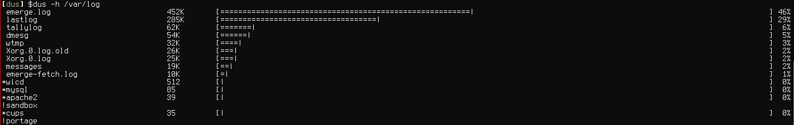

dus
===

Console tool which lists the contents of the given directory(ies) as graphs based on file sizes. Ability to order the result, ascending or descending, based on name, size or other parameters.

### Status
Current stable version: v0.0.10.

## Background
I was missing a command line tool which simply summarized the current directory's size (recursively). This because I'm always running out of disk space when there's no time to spare. I found myself using GNU's `du -s` (oh, thereof the name) quite often (no, I don't have any graphical file manager installed); but the result is neither sorted nor quickly interpreted. This application scratches one, out of many, of my personal itches.

## Screenshot

## Usage
    // Summarize current directory
    $ dus .

    // Summarize find result
    $ find /var/log -name "*log" | dus

    // Summarize /usr/include and pass to less
    $ dus /usr/include | less

## Compilation
Everything is written in C++14 and is simply compiled, installed and uninstalled using make.

## Releases
### v0.0.1
* Order by name or size in ascending or descending order
* Optional limit of item count in result
* Optional inverted order of printout
* Optional human readable printout

### v0.0.2
* Optional natural sort order for names
* Optional timeout, given in milliseconds, for directory parsing

### v0.0.3
* Support to define file as target
* Properly handle multi-byte (UTF-8) characters in output
* Fixed file permission evaluation logic

### v0.0.4
* Support to define multiple targets
* Support to pass target(s) through stdin
* Default target is now blocking read of stdin instead of current directory
* Improved file permission evaluation logic
* Improved natural order logic

### v0.0.5
* Removed curses dependency
* Fixed garbage when output was piped to other program

### v0.0.6
* Now compiles with: -Wall -Werror
* Support order by atime, mtime or ctime
* Support colorized output

### v0.0.7
* Initial Makefile
* Dynamic width based on file names and sizes
* Support for thousand separator in file sizes

### v0.0.8
* Fixed runtime error in v0.0.7

### v0.0.9
* Now compiles using clang
* Fixed regression in v0.0.7 where '-c' option didn't work

### v0.0.10
* Fixed overflow issue while parsing large files/directories
* Fixed handling of home directory (~) in paths
* Improved authorization check logic
* Added PKBUILD file

## License
This project is licensed under GPLv3.
